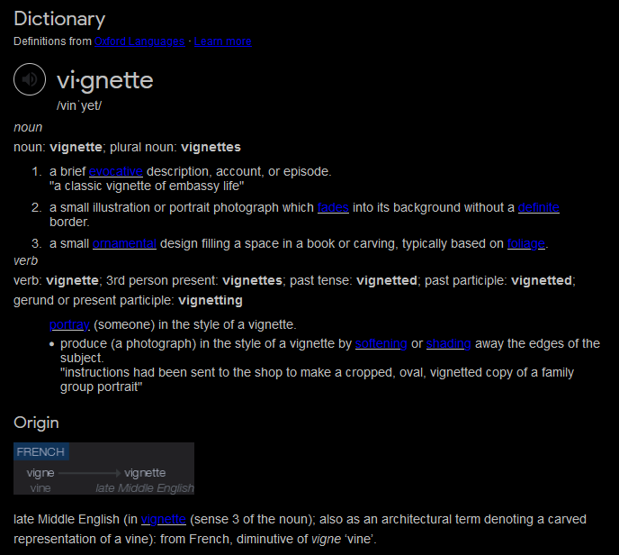

<!-- backgroundColor: black -->
<!-- _backgroundImage: "linear-gradient(to top, #85110d, 1%, black)" -->
# Vignette 00   About these "vignettes"

Julien Arino   

Department of Mathematics
University of Manitoba*

* The University of Manitoba campuses are located on original lands of Anishinaabeg, Cree, Oji-Cree, Dakota and Dene peoples, and on the homeland of the Métis Nation.

---

<!-- _backgroundImage: "linear-gradient(to top, #85110d, 1%, black)" -->
# Outline

- What are "vignettes"?
- What's in my vignettes?
- Who's this for?
- Organisation of the vignettes
- The GitHub repo(sitory)

---

<!-- _backgroundImage: "linear-gradient(to top, #85110d, 1%, black)" -->
# <!--fit-->What are "vignettes"?

---

---

In the `R` world, vignettes are short "wordy" introductions to a topic or package

They are more user friendly than package manuals or help pages

Example: [deSolve](https://cran.r-project.org/web/packages/deSolve/index.html)

---

<!-- _backgroundImage: "linear-gradient(to top, #85110d, 1%, black)" -->
# <!--fit-->What's in my vignettes?

---

How-to's explaining how to implement some particular problems in `R`

Focus on problems that are relevant to mathematical modellers

---

<!-- _backgroundImage: "linear-gradient(to top, #85110d, 1%, black)" -->
# <!--fit-->Who's this for?

---

Modellers interested in using `R` instead of `python`, `matlab`, `mathematica`, `maple`, etc.

Students in Summer schools or one of the math epi or modelling courses I teach here and there 

Students registered in one of the courses I teach at UM in which I use `R`: some of the vignettes are required reading for you!

---

<!-- _backgroundImage: "linear-gradient(to top, #85110d, 1%, black)" -->
# <!--fit-->Organisation of the vignettes

---

Essentially, there is none! 

I have tried to group similar topics ... with more or less success

---

<!-- _backgroundImage: "linear-gradient(to top, #85110d, 1%, black)" -->
# <!--fit-->The GitHub repo(sitory)

---

